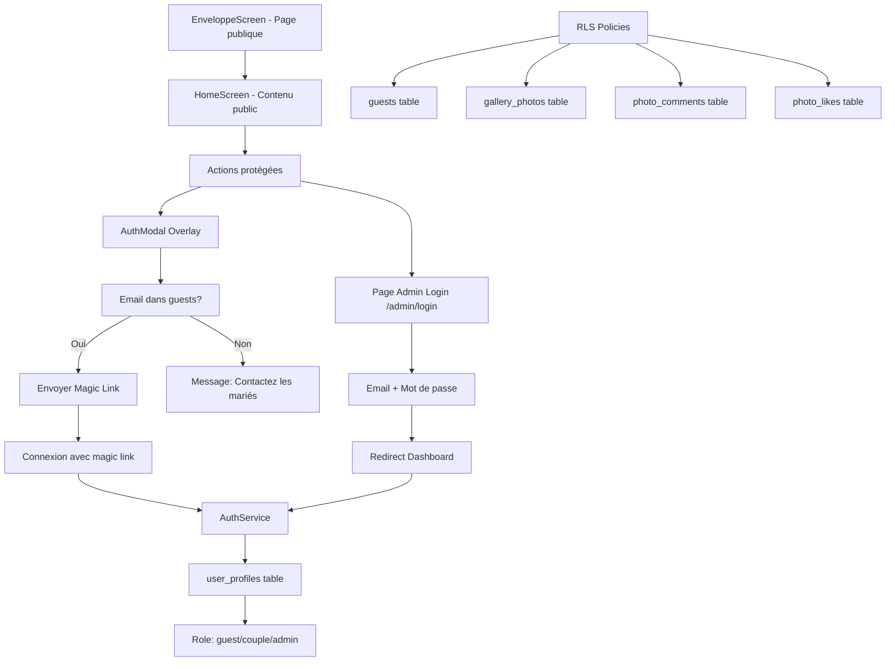

# Design: Système d'Authentification et Gestion des Rôles

**Feature:** auth-roles-system  
**Date:** 2026-01-09  
**Statut:** En cours de conception

---

## Overview

Ce système implémente une authentification multi-niveaux pour l'application de mariage. L'application gère trois types d'utilisateurs distincts : Invités (guest), Mariés (couple), et Admins. L'invité peut naviguer librement sans être connecté et n'est authentifié que lorsqu'il effectue une action protégée (RSVP, upload photo, commentaire). Les actions admin/marié nécessitent une connexion avec identifiants sur une page dédiée. L'authentification utilise Supabase avec magic links pour les invités et mots de passe pour les administrateurs, avec des politiques RLS pour sécuriser l'accès aux données.

## Architecture



## Components and Interfaces

### Component: AuthService

**Purpose:** Gérer l'authentification utilisateur avec support pour magic links (invités) et mots de passe (admin/mariés)

**Interface:**
```dart
class AuthService extends ChangeNotifier {
  User? get currentUser;
  String? get userRole;
  bool get isAuthenticated;
  bool get isCouple;
  bool get isAdmin;
  
  Future<AuthResponse> signIn({required String email, required String password});
  Future<void> sendMagicLink(String email);
  Future<bool> isGuestEmail(String email);
  Future<void> signOut();
  Future<void> _loadUserRole();
}
```

**Responsibilities:**
- Gérer les sessions utilisateur avec Supabase Auth
- Envoyer des magic links pour les invités
- Valider si un email fait partie des invités
- Charger et stocker le rôle de l'utilisateur
- Gérer la déconnexion

### Component: GuestService

**Purpose:** Gérer les opérations liées aux invités (RSVP, statistiques)

**Interface:**
```dart
class GuestService extends ChangeNotifier {
  List<Guest> get guests;
  Guest? get currentGuest;
  
  Future<bool> updateRSVP({
    required String guestId,
    required bool attending,
    int numberOfGuests,
    String? dietaryRestrictions,
    String? allergies,
  });
  
  Map<String, int> getRSVPStats();
}
```

**Responsibilities:**
- Mettre à jour le statut RSVP
- Collecter les préférences alimentaires
- Calculer les statistiques de participation
- Interagir avec la table `guests` via Supabase

### Component: AuthModal

**Purpose:** Modal contextuel pour authentifier l'utilisateur avant une action protégée

**Interface:**
```dart
class AuthModal extends StatefulWidget {
  final String action;
  final VoidCallback onAuthenticated;
  
  @override
  State<AuthModal> createState() => _AuthModalState();
}
```

**Responsibilities:**
- Afficher un modal en overlay
- Collecter l'email utilisateur
- Vérifier si l'email est dans la liste des invités
- Envoyer un magic link si valide
- Afficher un message d'erreur si email non trouvé

### Component: AuthGuard

**Purpose:** Route guard pour protéger les routes admin/marié

**Interface:**
```dart
class AuthGuard extends StatelessWidget {
  final List<String> requiredRoles;
  final Widget child;
  
  @override
  Widget build(BuildContext context);
}
```

**Responsibilities:**
- Vérifier si l'utilisateur est connecté
- Vérifier si l'utilisateur a un rôle autorisé
- Rediriger vers `/admin/login` si non autorisé
- Passer l'enfant authentifié

## Data Models

### Model: Guest

**Purpose:** Représente un invité à mariage

**Structure:**
```dart
class Guest {
  final String id;
  final String email;
  final String fullName;
  final String rsvpStatus; // 'pending', 'confirmed', 'declined'
  final int numberOfGuests;
  final String? dietaryRestrictions;
  final String? allergies;
  final DateTime createdAt;
  
  factory Guest.fromJson(Map<String, dynamic> json);
}
```

**Validation Rules:**
- `email` doit être un format d'email valide
- `rsvpStatus` doit être l'une des valeurs: 'pending', 'confirmed', 'declined'
- `numberOfGuests` doit être ≥ 1
- `dietaryRestrictions` et `allergies` sont optionnels mais limités à 500 caractères

### Model: UserProfile

**Purpose:** Représente les propriétés d'utilisateur liées à l'authentification

**Structure:**
```dart
class UserProfile {
  final String id;
  final String userId;
  final String? guestId;
  final String role; // 'guest', 'couple', 'admin'
  final String? avatarUrl;
  
  factory UserProfile.fromJson(Map<String, dynamic> json);
}
```

**Validation Rules:**
- `userId` doit faire référence à un utilisateur Supabase existant
- `guestId` doit faire référence à un invité existant ou être null
- `role` doit être l'une des valeurs: 'guest', 'couple', 'admin'
- Chaque `userId` ne peut avoir qu'un seul `UserProfile` (UNIQUE constraint)

### Model: Invitation

**Purpose:** Gère les invitations avec code unique

**Structure:**
```sql
CREATE TABLE public.invitations (
  id UUID PRIMARY KEY DEFAULT uuid_generate_v4(),
  guest_id UUID REFERENCES public.guests(id) ON DELETE CASCADE NOT NULL,
  invitation_code VARCHAR(50) UNIQUE NOT NULL,
  sent_at TIMESTAMP WITH TIME ZONE,
  opened_at TIMESTAMP WITH TIME ZONE,
  expires_at TIMESTAMP WITH TIME ZONE,
  created_at TIMESTAMP WITH TIME ZONE DEFAULT NOW()
);
```

**Validation Rules:**
- `invitation_code` doit être unique
- `guest_id` ne peut pas être null
- `expires_at` doit être après `sent_at`
- Un `invitation_code` ne peut être utilisé qu'une fois

## Correctness Properties

### Property 1: Role-based access control

*For any* route request with `AuthGuard`, if the user is authenticated and has a role in `requiredRoles`, then the protected widget is displayed; otherwise, the user is redirected to `/admin/login`.

**Validates: Requirements 4.1, 4.2**

### Property 2: Magic link only for guests

*For any* email submitted to `AuthModal`, if the email exists in `guests` table, then a magic link is sent; if not, an error message is displayed asking the user to contact the couple.

**Validates: Requirements 3.3, 3.4**

### Property 3: RSVP state preservation

*For any* valid RSVP update, the `guests` table is updated with the new status, number of guests, and dietary information; the update operation succeeds or fails atomically without partial updates.

**Validates: Requirements 5.1, 5.2**

### Property 4: RLS policy enforcement

*For any* database query on protected tables (`guests`, `gallery_photos`, `photo_comments`, `photo_likes`), if the user does not have appropriate role in `user_profiles`, then the query returns empty or fails with permission denied.

**Validates: Requirements 6.1, 6.2**

### Property 5: Session cleanup on sign out

*For any* user calling `signOut()`, the Supabase session is terminated, `_currentUser` and `_userRole` are set to null, and listeners are notified.

**Validates: Requirements 7.1**

## Error Handling

### Error Scenario 1: Invalid Magic Link

**Condition:** User opens a magic link with invalid or expired token
**Response:** Show error screen with message "Ce lien de connexion n'est plus valide. Veuillez demander un nouveau lien."
**Recovery:** User can request a new magic link by clicking "Demander un nouveau lien"

### Error Scenario 2: Email Already in Use

**Condition:** User tries to register with an email that already exists in `auth.users`
**Response:** Show error in `AdminLoginScreen`: "Cet email est déjà utilisé. Veuillez vous connecter."
**Recovery:** User is redirected to password login or can reset password

### Error Scenario 3: Database Connection Failure

**Condition:** Supabase client cannot connect to database
**Response:** Show global error indicator with message "Erreur de connexion. Vérifiez votre connexion internet."
**Recovery:** User can retry the action after network is restored; local caching may be used for offline mode in future

### Error Scenario 4: Role Not Found

**Condition:** User is authenticated but has no entry in `user_profiles` table
**Response:** Assign default role 'guest' and create `user_profiles` entry
**Recovery:** System automatically creates the missing profile; admin can update role later

## Testing Strategy

### Unit Testing Approach

**AuthService Tests:**
- Test `signIn()` with valid credentials returns AuthResponse
- Test `sendMagicLink()` for existing guest email
- Test `isGuestEmail()` returns true for guests, false for non-guests
- Test `signOut()` clears user state and notifies listeners
- Test `_loadUserRole()` returns correct role from `user_profiles`

**GuestService Tests:**
- Test `updateRSVP()` updates database and returns true
- Test `updateRSVP()` handles database errors and returns false
- Test `getRSVPStats()` returns correct counts for confirmed/declined/pending

**AuthModal Tests:**
- Test modal displays when action button clicked
- Test magic link sent when valid guest email provided
- Test error shown when email not in guests list
- Test `onAuthenticated` callback called after successful login

### Property-Based Testing Approach

**Property Test Library:** fast-check (Dart package: `fast_check`)

**Property 1: Role-based access determinism**
- *For all* combinations of user roles and route requirements, access is granted if and only if role is in required list
- **Validates: Property 1 - Role-based access control**

**Property 2: RSVP round-trip consistency**
- *For all* valid RSVP updates, reading the guest after update returns the modified values
- **Validates: Property 3 - RSVP state preservation**

**Property 3: Email uniqueness preservation**
- *For all* guest emails, `isGuestEmail()` returns consistent results across multiple calls
- **Validates: Property 2 - Magic link only for guests**

### Integration Testing Approach

**Authentication Flow Integration:**
- End-to-end test: User navigates to RSVP → AuthModal appears → Email entered → Magic link received → User clicks link → App opens → RSVP form submitted → Database updated
- End-to-end test: Admin enters credentials → Dashboard displayed → Admin accesses guest management → Guest data modified → Changes reflected in database

**RLS Policy Verification:**
- Test that guest can only read own guest data
- Test that couple can read and modify all guests
- Test that admin can read and modify all data including `user_profiles`

### Test Coverage Goals

- Unit test coverage: 90%+ for `AuthService` and `GuestService`
- Property-based tests: All correctness properties from design
- Integration tests: All critical user flows (auth, RSVP, admin dashboard)

## 1. High-Level Design

### 1.1 Architecture des Rôles

L'application gère 3 types d'utilisateurs distincts :

| Rôle | Description | Permissions |
|------|-------------|-------------|
| **Invité (guest)** | Personne invitée au mariage | Consulter l'invitation, confirmer RSVP, voir galerie, uploader photos, liker/commenter |
| **Marié (couple)** | Sonia & Aimé | Toutes permissions invité + gérer liste invités, valider RSVP, modérer galerie, voir statistiques |
| **Admin** | Administrateur technique | Accès complet : gestion invités, modération, logs, configuration |

### 1.2 Flux d'Authentification

**IMPORTANT :** C'est une invitation ! L'authentification se fait **à l'intérieur** de l'application, pas avant l'écran d'accueil.

#### Flux 1 : Premier Accès (Invité) - Expérience Invitation
```
EnveloppeScreen (animation d'ouverture)
    ↓
HomeScreen (contenu PUBLIC)
  • Countdown
  • Infos cérémonies
  • Photos approuvées
  • Programme
    ↓
Actions nécessitant identification :
  • RSVP → Modal de connexion contextuelle
  • Upload photo → Modal de connexion
  • Commenter/Liker → Modal de connexion
```

**L'invité peut naviguer librement SANS être connecté !**

#### Flux 2 : Modal de Connexion Contextuelle
Quand l'utilisateur clique sur une action nécessitant une authentification :
```
Action (RSVP, Upload, Comment)
    ↓
AuthModal apparaît (en overlay)
    ↓
Option 1: Email dans guests → Magic link
Option 2: Email inconnu → "Voulez-vous être ajouté à la liste ?"
    ↓
Une fois authentifié → Action validée
```

#### Flux 3 : Accès Admin/Marié (page dédiée)
1. Lien discret dans le footer ou menu
2. Page de login `/admin/login`
3. Email + mot de passe
4. Redirection vers dashboard approprié

### 1.3 Modèles de Données

#### Tables Existantes (à exploiter)
- `public.guests` : invités avec RSVP
- `public.admins` : administrateurs
- `public.gallery_photos` : photos avec statut
- `public.photo_likes`, `public.photo_comments` : interactions
- `public.activity_logs` : journal des actions

#### Nouvelles Tables à Créer

```sql
-- Lier les comptes auth.users aux invités
CREATE TABLE public.user_profiles (
  id UUID PRIMARY KEY DEFAULT uuid_generate_v4(),
  user_id UUID REFERENCES auth.users(id) UNIQUE NOT NULL,
  guest_id UUID REFERENCES public.guests(id),
  role VARCHAR DEFAULT 'guest' CHECK (role IN ('guest', 'couple', 'admin')),
  avatar_url TEXT,
  created_at TIMESTAMP DEFAULT NOW(),
  updated_at TIMESTAMP DEFAULT NOW()
);

-- Invitations (liens uniques)
CREATE TABLE public.invitations (
  id UUID PRIMARY KEY DEFAULT uuid_generate_v4(),
  guest_id UUID REFERENCES public.guests(id) NOT NULL,
  invitation_code VARCHAR UNIQUE NOT NULL,
  sent_at TIMESTAMP,
  opened_at TIMESTAMP,
  expires_at TIMESTAMP
);
```

### 1.4 Sécurité et RLS Policies

```sql
-- Politique RLS pour guests
CREATE POLICY "Guests can read own data"
  ON guests FOR SELECT
  USING (auth.uid()::text = email OR 
         EXISTS (SELECT 1 FROM user_profiles WHERE user_id = auth.uid()));

CREATE POLICY "Couple can manage all guests"
  ON guests FOR ALL
  USING (EXISTS (
    SELECT 1 FROM user_profiles 
    WHERE user_id = auth.uid() AND role IN ('couple', 'admin')
  ));
```

---

## 2. Low-Level Design

### 2.1 Services Flutter

#### 2.1.1 AuthService

```dart
// lib/services/auth_service.dart

import 'package:supabase_flutter/supabase_flutter.dart';

class AuthService extends ChangeNotifier {
  final SupabaseClient _client = Supabase.instance.client;
  
  User? _currentUser;
  String? _userRole; // 'guest', 'couple', 'admin'
  
  User? get currentUser => _currentUser;
  String? get userRole => _userRole;
  bool get isAuthenticated => _currentUser != null;
  bool get isCouple => _userRole == 'couple';
  bool get isAdmin => _userRole == 'admin';
  
  /// Connexion avec email/mot de passe
  Future<AuthResponse> signIn({
    required String email,
    required String password,
  }) async {
    final response = await _client.auth.signInWithPassword(
      email: email,
      password: password,
    );
    
    if (response.user != null) {
      _currentUser = response.user;
      await _loadUserRole();
      notifyListeners();
    }
    
    return response;
  }
  
  /// Connexion avec magic link (pour invités)
  Future<void> sendMagicLink(String email) async {
    await _client.auth.signInWithOtp(
      email: email,
      emailRedirectTo: 'mariage-pasteur://auth-callback',
    );
  }
  
  /// Vérifier si un email est dans la liste des invités
  Future<bool> isGuestEmail(String email) async {
    final response = await _client
        .from('guests')
        .select('id')
        .eq('email', email)
        .maybeSingle();
    
    return response != null;
  }
  
  /// Déconnexion
  Future<void> signOut() async {
    await _client.auth.signOut();
    _currentUser = null;
    _userRole = null;
    notifyListeners();
  }
  
  /// Charger le rôle de l'utilisateur
  Future<void> _loadUserRole() async {
    if (_currentUser == null) return;
    
    final response = await _client
        .from('user_profiles')
        .select('role')
        .eq('user_id', _currentUser!.id)
        .maybeSingle();
    
    _userRole = response?['role'] ?? 'guest';
  }
}
```
#### 2.1.2 GuestService

```dart
// lib/services/guest_service.dart

class GuestService extends ChangeNotifier {
  final SupabaseClient _client = Supabase.instance.client;
  
  List<Guest> _guests = [];
  Guest? _currentGuest;
  
  List<Guest> get guests => _guests;
  Guest? get currentGuest => _currentGuest;
  
  /// Mettre à jour le RSVP
  Future<bool> updateRSVP({
    required String guestId,
    required bool attending,
    int numberOfGuests = 1,
    String? dietaryRestrictions,
    String? allergies,
  }) async {
    try {
      await _client.from('guests').update({
        'rsvp_status': attending ? 'confirmed' : 'declined',
        'number_of_guests': numberOfGuests,
        'dietary_restrictions': dietaryRestrictions,
        'allergies': allergies,
        'updated_at': DateTime.now().toIso8601String(),
      }).eq('id', guestId);
      
      return true;
    } catch (e) {
      return false;
    }
  }
  
  /// Statistiques RSVP
  Map<String, int> getRSVPStats() {
    int confirmed = 0, declined = 0, pending = 0, totalGuests = 0;
    
    for (final guest in _guests) {
      switch (guest.rsvpStatus) {
        case 'confirmed':
          confirmed++;
          totalGuests += guest.numberOfGuests;
          break;
        case 'declined':
          declined++;
          break;
        case 'pending':
          pending++;
          break;
      }
    }
    
    return {
      'confirmed': confirmed,
      'declined': declined,
      'pending': pending,
      'total_guests': totalGuests,
    };
  }
}
```

### 2.2 Modèles de Données

```dart
// lib/models/guest.dart

class Guest {
  final String id;
  final String email;
  final String fullName;
  final String rsvpStatus; // 'pending', 'confirmed', 'declined'
  final int numberOfGuests;
  final String? dietaryRestrictions;
  final String? allergies;
  final DateTime createdAt;
  
  Guest({
    required this.id,
    required this.email,
    required this.fullName,
    required this.rsvpStatus,
    this.numberOfGuests = 1,
    this.dietaryRestrictions,
    this.allergies,
    required this.createdAt,
  });
  
  factory Guest.fromJson(Map<String, dynamic> json) {
    return Guest(
      id: json['id'],
      email: json['email'],
      fullName: json['full_name'] ?? '',
      rsvpStatus: json['rsvp_status'] ?? 'pending',
      numberOfGuests: json['number_of_guests'] ?? 1,
      dietaryRestrictions: json['dietary_restrictions'],
      allergies: json['allergies'],
      createdAt: DateTime.parse(json['created_at']),
    );
  }
}
```

```dart
// lib/models/user_profile.dart

class UserProfile {
  final String id;
  final String userId;
  final String? guestId;
  final String role; // 'guest', 'couple', 'admin'
  final String? avatarUrl;
  
  UserProfile({
    required this.id,
    required this.userId,
    this.guestId,
    required this.role,
    this.avatarUrl,
  });
  
  factory UserProfile.fromJson(Map<String, dynamic> json) {
    return UserProfile(
      id: json['id'],
      userId: json['user_id'],
      guestId: json['guest_id'],
      role: json['role'],
      avatarUrl: json['avatar_url'],
    );
  }
}
```
### 2.3 Écrans à Créer

#### Liste des écrans nécessaires :

1. **AuthModal** (`lib/widgets/auth_modal.dart`) - **NOUVEAU : Modal contextuelle**
   - Apparaît en overlay lors des actions protégées
   - Champ email avec vérification dans `guests`
   - Magic link pour les invités
   - Message "Contactez les mariés" si email non trouvé

2. **AdminLoginScreen** (`lib/screens/admin/admin_login_screen.dart`)
   - Page dédiée pour admin/mariés
   - Email + mot de passe
   - Accès via lien discret dans le footer

3. **AdminDashboardScreen** (`lib/screens/admin/admin_dashboard_screen.dart`)
   - Statistiques RSVP
   - Actions rapides
   - Logs d'activité récente

4. **GuestManagementScreen** (`lib/screens/admin/guest_management_screen.dart`)
   - Liste des invités avec filtres
   - Ajouter/modifier/supprimer invité
   - Export CSV

5. **PhotoModerationScreen** (`lib/screens/admin/photo_moderation_screen.dart`)
   - Photos en attente
   - Approuver/rejeter avec raison

6. **CoupleDashboardScreen** (`lib/screens/couple/couple_dashboard_screen.dart`)
   - Statistiques simplifiées
   - Gestion des invités
   - Modération photos

### 2.4 Configuration Supabase

#### Migrations SQL à exécuter :

```sql
-- Migration: 002_create_user_profiles.sql

CREATE TABLE IF NOT EXISTS public.user_profiles (
  id UUID PRIMARY KEY DEFAULT uuid_generate_v4(),
  user_id UUID REFERENCES auth.users(id) ON DELETE CASCADE UNIQUE NOT NULL,
  guest_id UUID REFERENCES public.guests(id) ON DELETE SET NULL,
  role VARCHAR(20) DEFAULT 'guest' CHECK (role IN ('guest', 'couple', 'admin')),
  avatar_url TEXT,
  created_at TIMESTAMP WITH TIME ZONE DEFAULT NOW(),
  updated_at TIMESTAMP WITH TIME ZONE DEFAULT NOW()
);

-- Index pour performance
CREATE INDEX idx_user_profiles_user_id ON public.user_profiles(user_id);
CREATE INDEX idx_user_profiles_guest_id ON public.user_profiles(guest_id);

-- Activer RLS
ALTER TABLE public.user_profiles ENABLE ROW LEVEL SECURITY;

-- Politiques RLS
CREATE POLICY "Users can read own profile"
  ON public.user_profiles FOR SELECT
  USING (auth.uid() = user_id);

CREATE POLICY "Admins can read all profiles"
  ON public.user_profiles FOR SELECT
  USING (EXISTS (
    SELECT 1 FROM public.user_profiles p
    WHERE p.user_id = auth.uid() AND p.role = 'admin'
  ));

-- Trigger pour updated_at
CREATE OR REPLACE FUNCTION update_updated_at_column()
RETURNS TRIGGER AS $$
BEGIN
  NEW.updated_at = NOW();
  RETURN NEW;
END;
$$ language 'plpgsql';

CREATE TRIGGER update_user_profiles_updated_at
  BEFORE UPDATE ON public.user_profiles
  FOR EACH ROW
  EXECUTE FUNCTION update_updated_at_column();
```

```sql
-- Migration: 003_create_invitations.sql

CREATE TABLE IF NOT EXISTS public.invitations (
  id UUID PRIMARY KEY DEFAULT uuid_generate_v4(),
  guest_id UUID REFERENCES public.guests(id) ON DELETE CASCADE NOT NULL,
  invitation_code VARCHAR(50) UNIQUE NOT NULL,
  sent_at TIMESTAMP WITH TIME ZONE,
  opened_at TIMESTAMP WITH TIME ZONE,
  expires_at TIMESTAMP WITH TIME ZONE,
  created_at TIMESTAMP WITH TIME ZONE DEFAULT NOW()
);

-- Index
CREATE INDEX idx_invitations_code ON public.invitations(invitation_code);
CREATE INDEX idx_invitations_guest_id ON public.invitations(guest_id);

-- RLS
ALTER TABLE public.invitations ENABLE ROW LEVEL SECURITY;

CREATE POLICY "Invitations readable by guest"
  ON public.invitations FOR SELECT
  USING (
    guest_id IN (
      SELECT id FROM public.guests WHERE email = auth.uid()::text
    )
    OR EXISTS (
      SELECT 1 FROM public.user_profiles
      WHERE user_id = auth.uid() AND role IN ('couple', 'admin')
    )
  );
```
### 2.5 Routes et Navigation

**IMPORTANT :** Pas de garde d'authentification sur les routes publiques !

```dart
// lib/main.dart - Configuration des routes

class MariageApp extends StatelessWidget {
  const MariageApp({super.key});

  @override
  Widget build(BuildContext context) {
    return MaterialApp(
      title: 'Sonia & Aimé - Mariage',
      debugShowCheckedModeBanner: false,
      theme: AppTheme.lightTheme,
      initialRoute: '/',
      routes: {
        // Routes publiques (invitation)
        '/': (context) => const EnveloppeScreen(),
        '/home': (context) => const WeddingBottomNav(),
        
        // Routes admin/mariés (protégées)
        '/admin/login': (context) => const AdminLoginScreen(),
        '/admin': (context) => const AuthGuard(
          requiredRoles: ['admin'],
          child: AdminDashboardScreen(),
        ),
        '/admin/guests': (context) => const AuthGuard(
          requiredRoles: ['admin', 'couple'],
          child: GuestManagementScreen(),
        ),
        '/admin/photos': (context) => const AuthGuard(
          requiredRoles: ['admin', 'couple'],
          child: PhotoModerationScreen(),
        ),
        '/couple': (context) => const AuthGuard(
          requiredRoles: ['couple'],
          child: CoupleDashboardScreen(),
        ),
      },
    );
  }
}
```

### 2.6 AuthModal - Connexion Contextuelle

```dart
// lib/widgets/auth_modal.dart

class AuthModal extends StatefulWidget {
  final String action; // 'rsvp', 'upload', 'comment'
  final VoidCallback onAuthenticated;
  
  const AuthModal({
    super.key,
    required this.action,
    required this.onAuthenticated,
  });
  
  @override
  State<AuthModal> createState() => _AuthModalState();
}

class _AuthModalState extends State<AuthModal> {
  final _emailController = TextEditingController();
  final _authService = AuthService();
  bool _isLoading = false;
  bool _emailSent = false;
  
  @override
  Widget build(BuildContext context) {
    return Dialog(
      shape: RoundedRectangleBorder(borderRadius: BorderRadius.circular(16)),
      child: Padding(
        padding: const EdgeInsets.all(24),
        child: Column(
          mainAxisSize: MainAxisSize.min,
          children: [
            Icon(Icons.lock_outline, size: 48, color: AppColors.primary),
            const SizedBox(height: 16),
            Text(
              'Identifiez-vous',
              style: Theme.of(context).textTheme.titleLarge,
            ),
            const SizedBox(height: 8),
            Text(
              'Pour ${_getActionText()}, veuillez vous identifier.',
              textAlign: TextAlign.center,
              style: Theme.of(context).textTheme.bodyMedium,
            ),
            const SizedBox(height: 24),
            if (!_emailSent) ...[
              TextField(
                controller: _emailController,
                decoration: const InputDecoration(
                  labelText: 'Votre email',
                  border: OutlineInputBorder(),
                ),
                keyboardType: TextInputType.emailAddress,
              ),
              const SizedBox(height: 16),
              ElevatedButton(
                onPressed: _isLoading ? null : _sendMagicLink,
                child: _isLoading
                    ? const CircularProgressIndicator()
                    : const Text('Recevoir un lien de connexion'),
              ),
            ] else ...[
              const Icon(Icons.mark_email_read, size: 64, color: Colors.green),
              const SizedBox(height: 16),
              const Text(
                'Un lien de connexion a été envoyé à votre email.',
                textAlign: TextAlign.center,
              ),
            ],
          ],
        ),
      ),
    );
  }
  
  String _getActionText() {
    switch (widget.action) {
      case 'rsvp': return 'confirmer votre présence';
      case 'upload': return 'ajouter une photo';
      case 'comment': return 'commenter';
      default: return 'continuer';
    }
  }
  
  Future<void> _sendMagicLink() async {
    if (_emailController.text.isEmpty) return;
    
    setState(() => _isLoading = true);
    
    try {
      // Vérifier si l'email est dans la liste des invités
      final isGuest = await _authService.isGuestEmail(_emailController.text);
      
      if (!isGuest) {
        if (mounted) {
          ScaffoldMessenger.of(context).showSnackBar(
            const SnackBar(
              content: Text('Cet email n\'est pas dans la liste des invités. Contactez les mariés.'),
            ),
          );
        }
        setState(() => _isLoading = false);
        return;
      }
      
      // Envoyer le magic link
      await _authService.sendMagicLink(_emailController.text);
      
      setState(() {
        _isLoading = false;
        _emailSent = true;
      });
    } catch (e) {
      setState(() => _isLoading = false);
      if (mounted) {
        ScaffoldMessenger.of(context).showSnackBar(
          SnackBar(content: Text('Erreur: $e')),
        );
      }
    }
  }
}

// Utilisation dans RSVPScreen
class RSVPScreen extends StatelessWidget {
  void _handleSubmit(BuildContext context) async {
    final authService = Provider.of<AuthService>(context, listen: false);
    
    if (!authService.isAuthenticated) {
      showDialog(
        context: context,
        builder: (context) => AuthModal(
          action: 'rsvp',
          onAuthenticated: () {
            Navigator.pop(context);
            _submitRSVP(context);
          },
        ),
      );
    } else {
      _submitRSVP(context);
    }
  }
  
  void _submitRSVP(BuildContext context) {
    // Logique de soumission RSVP
  }
}
```

---

## 3. Intégration avec l'Existant

### 3.1 Modifications à apporter

#### Fichier `main.dart`
- Ajouter `Provider` pour les services
- Configurer les routes avec authentification seulement pour admin
- Les routes publiques restent accessibles sans auth

#### Fichier `rsvp_screen.dart`
- **AJOUTER** : Vérification authentification avant soumission
- **AJOUTER** : Modal de connexion contextuelle si non authentifié
- **MODIFIER** : Sauvegarder en base via `GuestService.updateRSVP()`
- **PRÉ-SERVIR** : Pré-remplir si invité déjà connecté

#### Fichier `gallery_service.dart`
- **AJOUTER** : Modal de connexion avant upload
- Lier les photos au `guest_id` de l'utilisateur connecté
- Vérifier les permissions avant upload

#### Fichier `enveloppe_screen.dart`
- **PAS DE MODIFICATION** : L'invitation reste publique
- Pas de vérification d'authentification

#### Fichier `home_screen.dart`
- **PAS DE MODIFICATION** : Contenu public
- Ajouter lien discret vers `/admin/login` dans le footer

### 3.2 Structure des dossiers

```
lib/
├── main.dart
├── supabase_config.dart
├── models/
│   ├── guest.dart
│   ├── user_profile.dart
│   ├── activity_log.dart
│   └── wedding_data.dart (existant)
├── services/
│   ├── auth_service.dart (NOUVEAU)
│   ├── guest_service.dart (NOUVEAU)
│   ├── admin_service.dart (NOUVEAU)
│   └── gallery_service.dart (existant - à modifier)
├── screens/
│   ├── admin/ (NOUVEAU)
│   │   ├── admin_login_screen.dart
│   │   ├── admin_dashboard_screen.dart
│   │   ├── guest_management_screen.dart
│   │   └── photo_moderation_screen.dart
│   ├── couple/ (NOUVEAU)
│   │   └── couple_dashboard_screen.dart
│   ├── enveloppe_screen.dart (existant - PAS de modif)
│   ├── home_screen.dart (existant - ajouter lien admin)
│   ├── rsvp_screen.dart (existant - à modifier)
│   └── galerie_screen.dart (existant - à modifier)
└── widgets/
    ├── auth_modal.dart (NOUVEAU - Modal contextuelle)
    ├── auth_guard.dart (NOUVEAU - Pour admin seulement)
    └── wedding_bottom_nav.dart (existant)
```

---

## 4. Points d'Attention

### 4.1 Sécurité
- Ne jamais stocker de mots de passe en clair
- Utiliser les RLS policies de Supabase
- Valider les entrées utilisateur côté client ET serveur
- Logs d'activité pour traçabilité

### 4.2 Performance
- Index sur les colonnes fréquemment requêtées
- Pagination pour les listes (invités, photos)
- Cache des données utilisateur côté client

### 4.3 UX
- Magic link pour les invités (pas de mot de passe à retenir)
- Feedback visuel pendant le chargement
- Messages d'erreur clairs et localisés
- Déconnexion automatique après inactivité

---

## 5. Prochaines Étapes

1. **Créer les migrations SQL** pour les nouvelles tables
2. **Implémenter AuthService** avec tests
3. **Créer les écrans d'authentification** (login/register)
4. **Modifier RSVPScreen** pour persister en base
5. **Implémenter le dashboard admin** avec statistiques
6. **Ajouter la modération photos** pour couple/admin
7. **Configurer les RLS policies** dans Supabase
8. **Tester les flux d'authentification** pour chaque rôle
